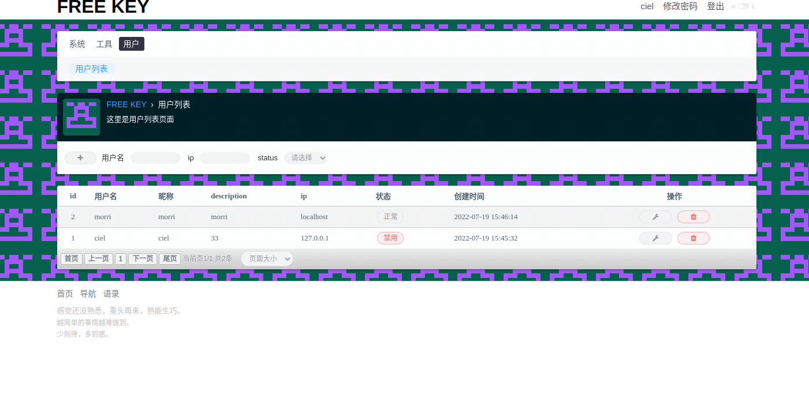

# 命令行代码生成

```text

███████╗██████╗ ███████╗███████╗    ██╗  ██╗███████╗██╗   ██╗     █████╗ ██████╗ ███╗   ███╗██╗███╗   ██╗
██╔════╝██╔══██╗██╔════╝██╔════╝    ██║ ██╔╝██╔════╝╚██╗ ██╔╝    ██╔══██╗██╔══██╗████╗ ████║██║████╗  ██║
█████╗  ██████╔╝█████╗  █████╗      █████╔╝ █████╗   ╚████╔╝     ███████║██║  ██║██╔████╔██║██║██╔██╗ ██║
██╔══╝  ██╔══██╗██╔══╝  ██╔══╝      ██╔═██╗ ██╔══╝    ╚██╔╝      ██╔══██║██║  ██║██║╚██╔╝██║██║██║╚██╗██║
██║     ██║  ██║███████╗███████╗    ██║  ██╗███████╗   ██║       ██║  ██║██████╔╝██║ ╚═╝ ██║██║██║ ╚████║
╚═╝     ╚═╝  ╚═╝╚══════╝╚══════╝    ╚═╝  ╚═╝╚══════╝   ╚═╝       ╚═╝  ╚═╝╚═════╝ ╚═╝     ╚═╝╚═╝╚═╝  ╚═══╝
Welcome to use the build tools of freekey, let's go!
```

## 命令介绍

到项目根目录下执行 `./main g -h` 可以看到如下名称

```text
➜  ciel-admin git:(master) ✗ ./main g -h                                                                                                            
USAGE
    ciel g [OPTION]

OPTION
    -q, --queryField        查询字段,eg: t1.*,t2.uname uname
    -o, --orderBy           排序，eg: t1.id desc
    -t1, --t1               主查询表,说明添加了关联字段,记得后面添加查询字段
    -t2, --t2               关联表,eg: u_user t2 on t2.id = t1.uid
    -t3, --t3               关联表,eg: u_login_log t3  on t3.uid = t2.id
    -t4, --t4               关联表,eg: u_wallet t4  on t4.uid = t2.id
    -t5, --t5               关联表,eg: u_user_info t5  on t5.uid = t2.id
    -t6, --t6               关联表,eg: u_operation t6  on t6.uid = t2.id
    -hadd, --hideAddBtn     隐藏添加按钮 eg 1
    -hedit, --hideEditBtn   隐藏修改按钮 eg 1
    -hdel, --hideDelBtn     隐藏删除按钮 eg 1
    -hs, --hideStatus       隐藏状态 eg 1
    -desc, --pageDesc       页面描述
    -logo, --pageLogo       页面图标,为空将随机生成
    -name, --pageName       页面菜单名称
    -g, --genType           生成类型1 crud 2静态页面
    -group, --htmlGroup     html页面分组分组文件夹 '项目/resource/template/你输入的分组文件' eg sys
    -h, --help              more information about this command

DESCRIPTION
    生成代码
```

## 数据库字段配置

在你创建数据表时可以是使用 `{"key":"value"}` json字符串的方式对该字段的相关操作进行配置
可配置的值如下

```text
type GenFiled struct {
	*gdb.TableField
	Label      string // 字段的名称 为空将使用默认字段
	FieldType  string // 字段的html类型 text(默认),textarea,markdown,select,number,date,datetime
	SearchType int    // 字段的搜索类型 0 不查询(默认),1 = ,2 like,3 >, 4 <, 5>=,6 <=,7 !=
	EditHide   int    // 编辑时是否隐藏 1 隐藏,默认不隐藏
	AddHide    int    // 添加时是否隐藏 1 隐藏,默认不隐藏
	Hide       int    // 列表该字段是否隐藏 1隐藏,默认不隐藏
	Disabled   int    // 编辑时是是否禁用  1是的,默认否
	Required   int    // 添加是是否必须  1是,默认否
	Comment    string // 字段说明描述，不为空则 在添加和编辑时会展示该描述
	Options    string // 当 FieldType为例 `select`时 进行的选项 格式 "值:名称:类名,值:名称:类名"  eg "1:文本:tag-info,2:图片:tag-warning,3:富文本:tag-primary,4:文件:tag-danger,5:其他:tag-purple"
	QueryName  string // 不用设置，生成时会如果有额外的关联查询程序会提示进行填写
}
```

在生成代码时，程序会对配置的json进行解析。 如下面的demo。

```text
create table s_admin_login_log
(
    id         int auto_increment primary key,
    uid        int           null comment '{"label":"用户id","searchType":1,"hide":1,"disabled":1,"required":1}',
    ip         varchar(64)   null comment '{"label":"登录IP","notShow":0,"fieldType":"text","editHide":0,"editDisabled":0,"required":1} ',
    area       varchar(64)   null comment '{"searchType":2,"hide":1}',
    status     int default 1 null,
    created_at datetime      null,
    updated_at datetime      null,
    foreign key (uid) references s_admin (id) on delete cascade
);
```

## Demo

我们以生成用户表和用户登录日志 表为例，演示如何使用命令行工具生成多表查询和单表查询的CRUD

### step1 数据表准备

```text
create table u_user
(
    id          bigint unsigned auto_increment primary key,
    uname       varchar(64)                        null comment '{"label":"用户名","searchType":2,"required":1,"disabled":1}',
    pass        varchar(64)                        not null comment '{"hide":1,"editHide":1}',
    nickname    varchar(64)                        null comment '{"label":"昵称","required":1,"comment":"取一个昵称吧"}',
    description text                               null comment '{"fieldType":"markdown"}',
    status      int      default 1                 null,
    created_at  datetime default CURRENT_TIMESTAMP null,
    updated_at  datetime default CURRENT_TIMESTAMP null,
    constraint uname unique (uname)
);

create table u_user_login_log
(
    id         bigint unsigned,
    uid        bigint unsigned,
    ip         varchar(64),
    created_at datetime default current_timestamp,
    foreign key (uid) references u_user (id) on delete cascade
)
```

### step2 config 添加配置

在 `manifest/config/config.yaml` 文件中添加 `u_user` 和`u_`

```text
gfcli:
  gen:
    dao:
      - link: "mysql:ciel:2zL4YEdLpLJirysN@tcp(127.0.0.1:3306)/ciel"
        tables: "s_admin,s_role,s_menu,s_role_menu,s_api,s_role_api,s_dict,s_file,s_operation_log,s_admin_login_log,
         f_node,
         u_user,u_user_login_log"
        removePrefix: "s_,f_,u_"
        descriptionTag: true
        noModelComment: true

```

### step3  使用gf生成基本代码

在项目根目录下运行`gf gen dao` 生成基本代码

```text
➜  ciel-admin git:(master) ✗ gf gen dao
generated: internal/dao/internal/admin.go
...
done!
```

### step4 命令行生成代码

1. 项目根目录下输入 `./main g -h` 可以看下我们需要对数据进行配置

2. 然后输入命令`./main g -t1 u_user -t2 "u_user_login_log t2 on t2.id = t1.uid" -q "t1.*,t2.ip ip" -name "用户列表" -desc "这里是用户列表页面" -group "user" -g 1`

- -t1 设置主表  `u_user`
- -t2 设置 关联表及关联关系 `u_user_login_log t2 on t2.id = t1.uid`
- -q 设置查询字段 `t1.*,t2.ip ip`
- -name 设置页面名称 `用户列表`
- -desc 设置页面描述 `这里是用户列表页面`
- -group 设置html文件分组 放在`user`文件夹下。生成的html文件会放到`resouce/template/user/user` 下面。第一user是分组，第二个是列表页面。该分组下可以放其他用户相关的信息。
- -g 设置生成类型  `1` CRUD文件生成。 `0` 为静态文件生成。后续会加入更多生成类型。

3. 回车提交后让我们选择页面主分页，如果是新的分类可以自己创建。

```text
---------父级菜单名:-------
0 系统
1 工具
--------------------
如果没有您的选项请自行输入:用户

```

4. 提交后会让我们是否设置关联字段

```text
是否添加关联表展示字段？(如果设置了关联查询，请设置相应字段)  1 yes ,0 no:	1
字段名称(eg t2.uname):	t2.ip
查询字段名称(eg uname):	ip
字段名称:	ip
查询类型 0 no,1 =,2 like,3 >, 4 <, 5 >=, 6 <=,7 !=	2
请输入元素位置:	2
是否添加关联表展示字段？(如果设置了关联查询，请设置相应字段)  1 yes ,0 no:	0
```

字段名称是关联表中的字段名，这里是`t2.ip`，查询字段是在第二步设置查询字段的 `t1.*,t2.ip ip` 别名 `ip`。
元素位置是设置列表在哪个位置展示。

输入完一次后会提示会是否再次添加，选择`0`结束操作。

```text


 ██████╗ ██╗  ██╗    ███████╗██╗███╗   ██╗██╗███████╗██╗  ██╗███████╗██████╗ 
██╔═══██╗██║ ██╔╝    ██╔════╝██║████╗  ██║██║██╔════╝██║  ██║██╔════╝██╔══██╗
██║   ██║█████╔╝     █████╗  ██║██╔██╗ ██║██║███████╗███████║█████╗  ██║  ██║
██║   ██║██╔═██╗     ██╔══╝  ██║██║╚██╗██║██║╚════██║██╔══██║██╔══╝  ██║  ██║
╚██████╔╝██║  ██╗    ██║     ██║██║ ╚████║██║███████║██║  ██║███████╗██████╔╝
 ╚═════╝ ╚═╝  ╚═╝    ╚═╝     ╚═╝╚═╝  ╚═══╝╚═╝╚══════╝╚═╝  ╚═╝╚══════╝╚═════╝ 
                                                                             
 
```

### 5 设置管理员权限

可以在`http://localhost:1211/menu/path` 查看已经多了两个菜单了。


在`http://localhost:1211/role/path` 角色页面对`Super Admin` 添加个两个菜单的权限.

### 6 重新登录就可以看到啦

我们在添加两个测试数据


